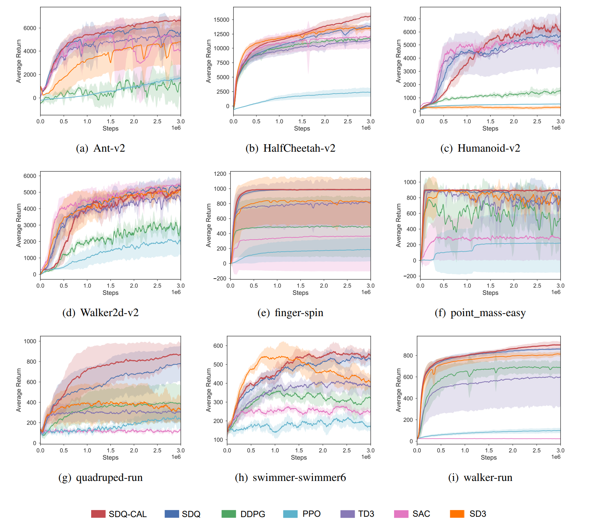

## Simultaneous Double Q-Learning with Conservative Advantage Learning

PyTorch implementation of paper "Simultaneous Double Q-Learning with Conservative Advantage Learning for Actor-Critic Methods (SDQ-CAL)" which is under review.
Method is tested on continuous control benchmark tasks from OpenAI
Gym and DeepMind Control Suite. Agents are trained using PyTorch 1.4 and Python 3.6.

## Instructions
### Recommend: Run with Docker
```bash
# python        3.6    (apt)
# pytorch       1.4.0  (pip)
# tensorflow    1.14.0 (pip)
# DMC Control Suite and MuJoCo
cd dockerfiles
docker build . -t lwdrl
```
For other dockerfiles, you can go to [RL Dockefiles](https://github.com/LQNew/Dockerfiles).

### Launch experiments
Run with the scripts `batch_run_mujoco_4seed_cuda.sh` / `batch_run_dmc_4seed_cuda.sh`:
```bash
# eg.
# For Mujoco env
bash batch_run_mujoco_4seed_cuda.sh Ant-v2 SDQ_CAL 0  # env_name: Ant-v2, algorithm: SDQ_CAL, CUDA_Num : 0
# For DMC env
bash batch_run_dmc_4seed_cuda.sh cheetah-run SDQ_CAL 1 # env_name: cheetah-run, algorithm: SDQ_CAL, CUDA_Num : 1
```

### Plot results
```bash
# eg. Notice: `-l` denotes labels, `SDQ_CAL-Ant-v2/` represents the collecting dataset, 
# and `-s` represents smoothing value.
python spinupUtils/plot_mujoco_dmc.py \
    data/SDQ_CAL-Ant-v2/ \
    -l SDQ_CAL -s 10
```

### Performance on MuJoCo / DMC
Including `Ant-v2`, `HalfCheetah-v2`, `Humanoid-v2`, `Walker2d-v2`, `finger-spin`, `point_mass-easy`, `quadruped-run`, `swimmer-swimmer6`, `walker-run`.

<br>